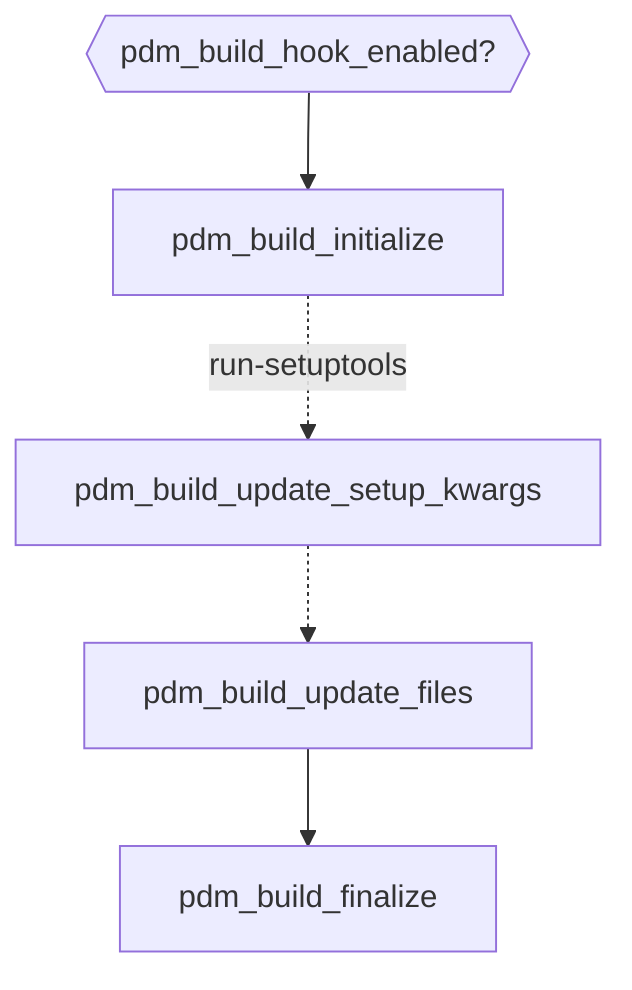

# Build hooks

It is rather easy to write a build hook, `pdm-backend` now provides 6 hooks for you to customize the every step of the build process, and you don't need to implement them all. Let's learn it with some examples.

## Modify the project metadata

=== "pdm_build.py"

    ```python
    def pdm_build_initialize(context):
        metadata = context.config.metadata
        metadata["dependencies"].append("requests")
    ```

The metadata can be accessed like a dictionary, and any update to the object will take effect immediately.
For sdist builds, the modified `pyproject.toml` will be written into the tarball.

!!! TIP
    As you can see, you don't need to import any specific stuff from `pdm.backend`. Of course, you may need to when you want
    to type-annotate your hook function.

## Add more files or change the collected files

There are two ways to achieve this.

1. Any files generated under `context.build_dir`, unless excluded by `excludes` setting, will be collected automatically.

=== "pdm_build.py"

    ```{ .python .annotate }
    def pdm_build_initialize(context):
        context.ensure_build_dir()  # make sure it is created.
        with open(os.path.join(context.build_dir, "COPYING.md"), "w") as f:  # (1)!
            f.write("This is a generated COPYING file.")
    ```

    1. The file will be packed as `COPYING.md` inside the artifact.

Or, you can generate it anywhere and include the path explicitly.

=== "pdm_build.py"

    ```{ .python .annotate }
    def pdm_build_update_files(context, files):
        extra_file_path = Path.home() / ".config/myconfig.yaml"
        files["myconfig.yaml"] = extra_file_path  # (1)!
    ```

    1. The file path inside the artifact will be `myconfig.yaml`.

## Call setup() function to build extensions

=== "pyproject.toml"

    ```toml
    [tool.pdm.build]
    run-setuptools = true
    ```

=== "pdm_build.py"

    ```python
    from setuptools import Extension

    ext_modules = [Extension("my_package.hello", ["my_package/hellomodule.c"])]

    def pdm_build_update_setup_kwargs(context, setup_kwargs):
        setup_kwargs.update(ext_modules=ext_modules)
    ```

## Enable the hook for a specific build target

Sometimes you only want to activate the hook for a specific hook, you can define the `pdm_build_hook_enabled()` hook:

=== "pdm_build.py"

    ```python
    def pdm_build_hook_enabled(context):
        # Only enable for sdist builds
        return context.target == "sdist"
    ```

You can also look at the `context` object inside a specific hook to determine it should be called.


## Build hooks flow

The hooks are called in the following order:



Read the [API references](./api.md) for more details.

## Distribute the hook as a plugin

If you want to share your hook with others, you can change the hook script file into a Python package and upload it to PyPI.

File structure:

```
pdm-build-mypyc
├── mypyc_build.py
├── LICENSE
├── README.md
└── pyproject.toml
```

=== "pyproject.toml"

    ```toml
    [build-system]
    requires = ["pdm-backend"]
    build-backend = "pdm.backend"

    [project]
    name = "pdm-build-mypyc"
    version = "0.1.0"
    description = "A pdm build hook to compile Python code with mypyc"
    authors = [{name = "...", email = "..."}]
    license = {text = "MIT"}
    readme = "README.md"

    [project.entry-points."pdm.build.hook"]
    mypyc = "mypyc_build:MypycBuildHook"
    ```

=== "mypyc_build.py"

    ```python
    class MypycBuildHook:
        def pdm_build_hook_enabled(self, context):
            return context.target == "wheel"

        def pdm_build_initialize(self, context):
            context.ensure_build_dir()
            mypyc_build(context.build_dir)
    ```


The plugin must be distributed with an entry point under `pdm.build.hook` group. The entry point value can be any of the following:

- A module containing hook functions
- A class object which implements the hook functions as methods
- An instance of the above class object

After it is published, another user can enable this hook by including the package name in `build-system.requires`:

```toml
[build-system]
requires = ["pdm-backend", "pdm-build-mypyc"]
build-backend = "pdm.backend"
```
